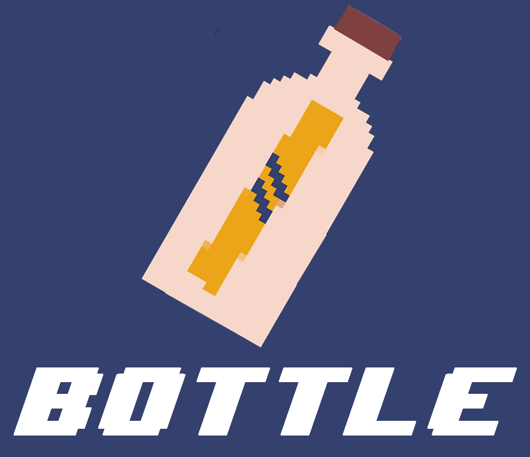

# ProjetC2_Blockchain

**BOTTLE : Une messagerie sécurisée écrite en C. Utilise uniquement : C, SDL, OPENSSL.**

Cette application est une simulation de messagerie qui fonctionne grâce aux blockchains. 
Assurant ainsi la sécurité des messages transmis, l’application permet aussi la création et la gestion de comptes dont les informations confidentielles sont chiffrées.

Installation
------------

### 1. Télécharger le code (optionnel si le code est déjà compilé et sous forme executable)

### 2. Installer les librairies :

- sudo apt-get install libsdl1.2-dev
- sudo apt-get install libsdl2-ttf-dev
- sudo apt-get install libsdl2-image-dev

- sudo apt-get install libssl-dev  

### 3. Executer le code une fois compilé (le make est dans les fichiers du code pour compiler sinon) :

(Si non compilé : - make)
- ./bottle

### 4. Fonctionnalités :

- Créer un nouveau compte : Vous pouvez créer un compte en écrivant votre identifiant et votre mot de passe

Cependant il est seulement possible de créer 5 comptes différents.
Il n'y a pas de bouton pour supprimer un compte donc il faut directement supprimer la ligne correspondante dans le fichier SaveID.txt

- Se connecter :  Pour vous connecter il suffit de rentrer les identifiants préalablement créer et si vous vous trompé, appuyez sur le bouton retour

- Choisir un destinataire : Rentrez directement le nom du destinataire que vous souhaitez parmi les choix proposé

- Envoyer des messages : Communiquez directement avec les autres utilisateurs via la messagerie qui affichera les derniers messages de la conversation. Si vous voulez changer de destinataire appuyez sur le bouton retour et reconnectez-vous.
